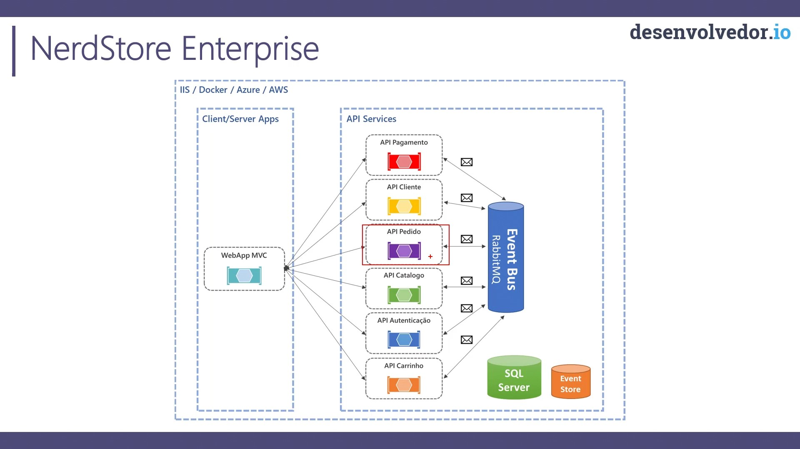
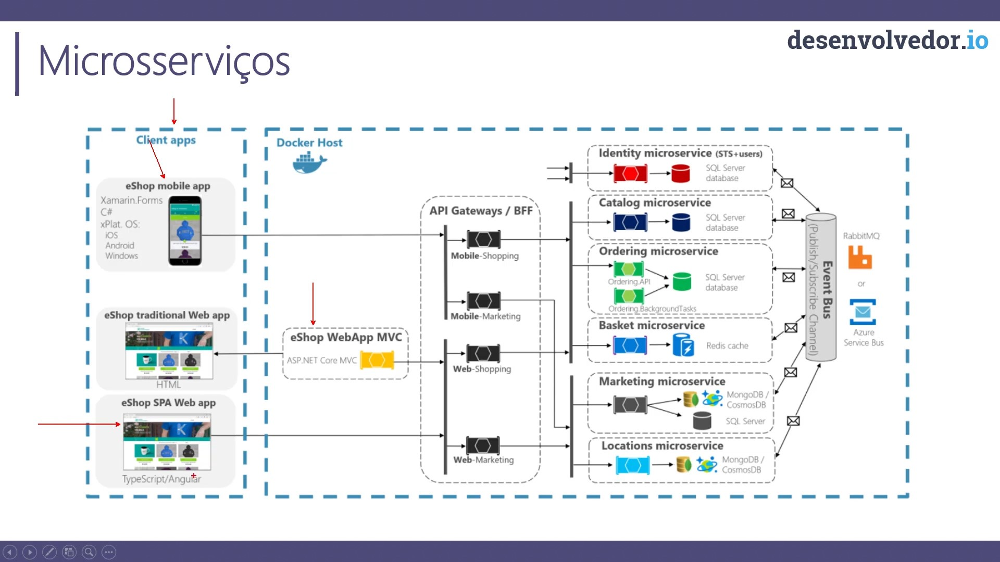

# ASP.NET - Core Enterprise Applications

Conteúdo do curso: https://desenvolvedor.io/curso-online-asp-net-core-enterprise-applications

## Microserviços vs API Distribuída

> API Distribuída

Basicamente, é o meio do caminho até uma arquitetura de microserviços. Diminui a complexidade, eliminando a nessessicade de uma API de Gateway. Ainda mantendo recursos como separação de responsabilidades, containeres e mensageria. Podendo, ou não, fazer uso de múltiplos bancos de dados.

> Microserviços

Mais complexa, dependente de um Gateway. O gateway ficaria responsável por traduzir os requests de diferentes origens para os devidos endpoints. Cada API, idealmente, utiliza um banco de dados separado. Alta complexidade de tracing de requests.

