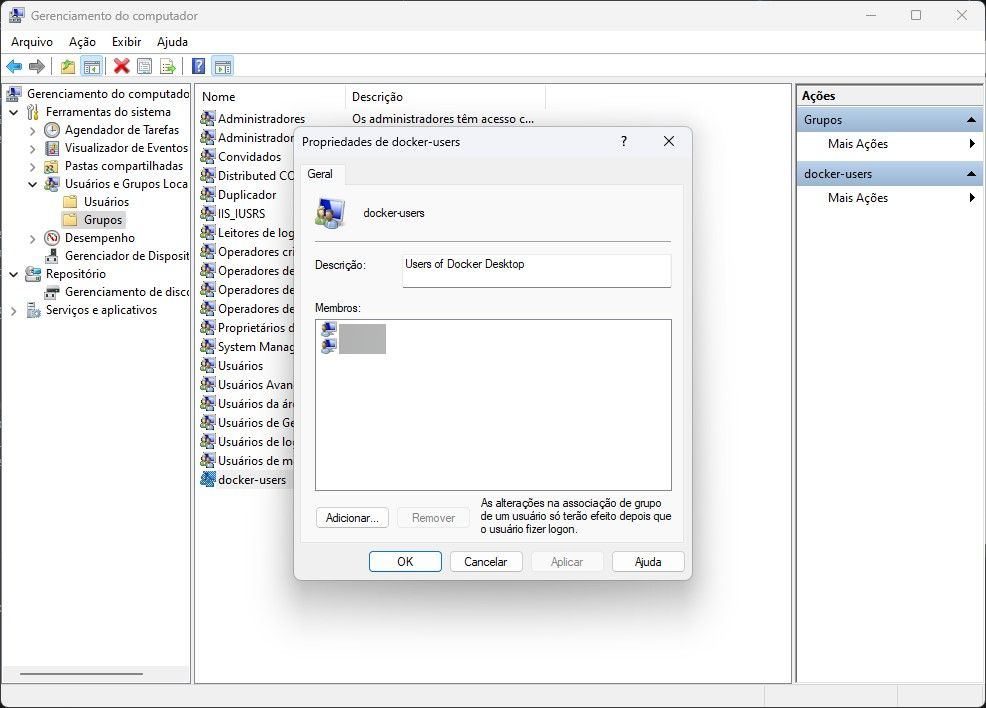

# ASP.NET - Core Enterprise Applications

Conteúdo do curso: https://desenvolvedor.io/curso-online-asp-net-core-enterprise-applications

## Microserviços vs API Distribuída

### API Distribuída

Basicamente, é o meio do caminho até uma arquitetura de microserviços. Diminui a complexidade, eliminando a nessessicade de uma API de Gateway. Ainda mantendo recursos como separação de responsabilidades, ecalonamento individual, containeres e mensageria. Podendo, ou não, fazer uso de múltiplos bancos de dados. Menor custo operacional.

### Microserviços

Mais complexa, dependente de um Gateway. O gateway ficaria responsável por traduzir os requests de diferentes origens para os devidos endpoints. Cada API, idealmente, utiliza um banco de dados separado. Alta complexidade de tracing de requests. Maior custo operacional.

## Docker

### Erro: Usuário atual não pertence ao grupo Docker

> Para adicionar-se ao grupo em Windows 10 ou posterior, siga estas etapas: No menu Iniciar, abra o Gerenciamento de Computadores. Expanda Usuários e Grupos Locais e selecione Grupos. Localize o grupo de usuários do docker, clique com o botão direito do mouse e selecione Adicionar ao grupo. Adicione sua conta de usuário ou contas.

Precisa realmente fazer Logoff e logon novamente na conta do Windows.

### Erro de arquivo Docker\config

Abrir o Docker Desktop antes de executar o projeto. Não abrir o Docker Desktop pela msg de alerta do Visual Studio.
